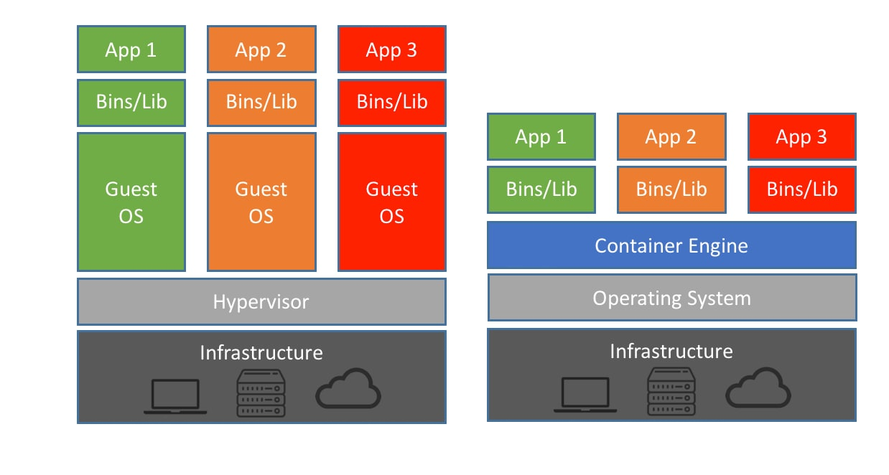
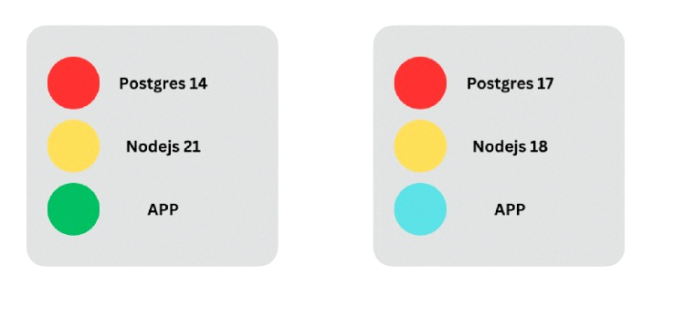

# Docker Workshop

In this workshop, we will explore Docker, a platform for building, running, and deploying applications in a consistent manner. The goal is to ensure that if an application works on your machine, it will work the same way on another person's computer without the common issues of missing files, software version mismatch, or different configuration settings.

## Pre-Introduction
### Concepts to Understand:
- Frontend
- Backend
- APIs
- Databases
- Basic terminal workflow

## 1. Introduction to Docker

**What is Docker?**
Docker is a platform for building, running, and deploying applications in containers, which helps solve the problem of applications not running consistently across different machines due to various issues like missing files, software version mismatch, and different configuration settings.

**Benefits of Docker:**
- Ensures consistent environments from development to production.
- Packages applications with all their dependencies.
- Isolates applications to prevent conflicts.
- Simplifies application deployment and rollback.
- Utilizes resources more efficiently than virtual machines.

**Containers vs. Virtual Machines:**
- **Virtual Machine:** Emulates a physical hardware system with its own full operating system.
- **Container:** Provides an isolated environment for applications, sharing the host system’s OS kernel, making them lighter and faster.



Because the virtual machine needs to run a full fletched OS, it consumes a lot more resources. It also needs to have dedicated resources, meaning that while the OS is running, even if it is not using the resources other applications can't use them.

**Why use containers:**
Docker installs the applications inside containers (isolated environments). This means that everything you application needs to run is downloaded and put inside the container, it does not depend on external factors:



In the image above we can see two containers that run on different versions of the same software needed, because they are contained inside the image, they do no interfere with each other.

**There is one edge case**

When I mentioned that docker images work on every computer, it was actually a white lie. Docker uses the kernel (think about the engine of your operating system) to run the containers. Therefore it can only run images if they ar compatible with the kernel of your pc.

The good news is: docker containers can run on every OS if you choose it well. Windows based docker images can only run on Windows because they are the only on to include the Windows kernel. However the other alternative is linux images, which will work on Windows (because of WSL), linux, and macos.

MacOS is a special case, since the macOS kernel does not allow for containers, docker runs on a single linux virtual machine, which means it can only run linux images.


## 2. Installing Docker

Installation instructions for various platforms can be found on the [official Docker website](https://docs.docker.com/engine/install/).

**Windows Users:** Ensure Hyper-V and Containers features are enabled. WSL (Windows Subsystem for Linux) might also need to be installed or updated.

**Verifying Installation:**
To verify Docker installation, open a terminal and type:
```bash
docker version
```

## 3. Development Workflow

## Pulling and Running a Pre-Built Image

Before diving into building our own Docker containers, it's beneficial to start with running a pre-built image from Docker Hub. This process demonstrates the ease and efficiency of deploying software using Docker.

### Pulling an Image from Docker Hub
Docker Hub is a registry service that allows you to find and share container images with your team and the Docker community. To pull an image, you use the `docker pull` command followed by the name of the image.

```bash
docker pull nginx
```

This command contacts Docker Hub and downloads the latest version of the `nginx` image, which is a pre-made setup for running an Nginx web server.

### Running the Pulled Image
Once the image is pulled, you can run it as a container. The `docker run` command creates a new container instance from a specified image and starts it.

```bash
docker run -d -p 80:80 nginx
```

Here’s what each part of the command does:
- `-d`: Runs the container in detached mode, meaning the container runs in the background.
- `-p 80:80`: Maps port 80 of the container to port 80 on the host. This allows you to access the Nginx web server by visiting http://localhost:80 on your browser.

### Viewing Running Containers
To see the containers that are currently running, you can use the `docker ps` command, which lists all active containers.

```bash
docker ps
```

This command provides details about all running containers, including their container ID, image name, creation time, and status.

### Stopping a Running Container
If you need to stop a container, you can use the `docker stop` command followed by the container ID or name.

```bash
docker stop <container_id>
```

Replace `<container_id>` with the actual ID of the container you want to stop. This command will stop the running container gracefully.

This introductory experience with pulling and running pre-built images prepares you for the next step, where you will learn to build and manage your own Docker images and containers.

**Introduction to Dockerfiles:**
A Dockerfile is a script containing commands that Docker uses to build images automatically.

### Simple Docker Workflow
- **Start with a base image** (from Docker Hub if available).
- **Install necessary applications.**
- **Copy the required files.**
- **Execute configuration commands.**
- **Specify the command to run the application.**

**Building a Docker Image:**
```bash
docker build -t <name> .
```
This command builds a Docker image based on the Dockerfile in the current directory.

**Listing Docker Images:**
```bash
docker image ls
```
This command lists all Docker images on your machine.

## Running and Interacting with Containers

In this section, we will learn how to create Docker containers, interact with them, and understand how Docker manages storage through volumes. By following the steps below, you'll gain practical experience in managing Docker containers and their lifecycles.

### Creating a Dockerfile
A Dockerfile is a text document that contains all the commands a user could call on the command line to assemble an image. Creating one allows you to automate the installation of software in a new image.

```bash
# Example Dockerfile
FROM python:3-8-slim
RUN pip install flask
COPY . /app
EXPOSE 5000
CMD ["python", "app.py"]
```

### Building and Running Containers
Once you have a Dockerfile, you can build the image and run it as a container. Here’s how you can do it:

```bash
docker build -t my-app .
docker run -d -p 80:80 my-app
```

This will build an image named `my-app` from the Dockerfile in the current directory and run it as a container detached, mapping port 80 of the container to port 80 on the host.

### Interacting with Containers
You can interact with running containers using various Docker commands:

```bash
docker ps  # Lists running containers (-a to also list the stopped ones)
docker stop <container_id or name>  # Stops a specified container
docker start <container_id or name>  # Starts a specified container
```

### Managing Docker Volumes
Volumes are used to persist data generated by and used by Docker containers. Here’s how to manage them:

```bash
docker volume create my-volume
docker run -d -v my-volume:/app/data my-app
```

This command creates a new volume named `my-volume` and mounts it to `/app/data` inside the running container, ensuring data persists.

### Cleaning Up
To clean up containers, images, and volumes, use the following commands:

```bash
docker rm <container_id or name>  # Removes specified container
docker image rm <name>  # Removes all dangling images
docker volume rm my-volume  # Removes a specified volume
```

## 5. Introduction to Docker Compose

**What is Docker Compose?**
Docker Compose is a tool for defining and running multi-container Docker applications. With Docker compose, you use a YAML file to configure your application’s services, networks, and volumes, and then with a single command, you create and start all the services.

### Writing a Docker Compose File
- Define a web application with a database (e.g., a simple Python Flask app with a PostgreSQL database).
- Services, networks, and volumes specified in a `docker-compose.yml` file.

### Running Docker Compose
- Starting and stopping services:
  ```bash
  docker-compose up
  ```
  ```bash
  docker-compose down
  ```

## 6. Docker Compose in practice

In this part we will be going over how to create a docker-compose file and crete an application that requires multiples containers.

In our example we will have a application with 3 services:
- A database in SQL
- A backend make in python using flask
- An nginx website running on the frontend 

### Creating the Docker Compose File
1. **Docker Compose File Setup**
   - Create a file named `docker-compose.yml` in your project directory.
   - Define three services in your Docker Compose file: `database`, `backend`, and `frontend`.
   - Here's an example of what your `docker-compose.yml` might look like:

     ```yaml
     version: '3.8'
     services:
       database:
         image: postgres
         environment:
           POSTGRES_DB: exampledb
           POSTGRES_USER: user
           POSTGRES_PASSWORD: password
         volumes:
           - db-data:/var/lib/postgresql/data
         restart: always

       backend:
         build: ./backend
         command: python app.py
         volumes:
           - ./backend:/code
         ports:
           - "5000:5000"
         depends_on:
           - database
         restart: always

       frontend:
         image: nginx
         ports:
           - "80:80"
         volumes:
           - ./frontend:/usr/share/nginx/html
         depends_on:
           - backend
         restart: always

     volumes:
       db-data:
     ```

#### Explanation of Components
- **version**: Declares the version of the Docker Compose API and syntax used.
- **services**: Defines the containers required for the application.
  - **database**:
    - `image`: Specifies the Docker image to use, in this case, `postgres`.
    - `environment`: Sets environment variables in the container, like database name, user, and password.
    - `volumes`: Maps persistent storage to the container.
    - `restart`: Policy for restarting the container automatically.
  - **backend**:
    - `build`: Location of the Dockerfile for the backend service.
    - `command`: Overrides the default command in the Docker image (runs `python app.py`).
    - `volumes`: Mounts code directory into the container.
    - `ports`: Maps port 5000 of the container to port 5000 on the host, necessary for accessing the Flask app.
    - `depends_on`: Ensures the backend starts only after the database is available.
  - **frontend**:
    - `image`: Uses the Nginx image from Docker Hub.
    - `ports`: Maps port 80 of the container to port 80 on the host, for HTTP access.
    - `volumes`: Serves the frontend files from the specified directory.
    - `depends_on`: Starts after the backend is up and running.
- **volumes**: Defines named volumes that can be used by services.

### Managing the Application with Docker Compose Commands
1. **Start Up the Services**
   - Bring up the services with:
     ```bash
     docker-compose up
     ```
   - This command starts all the services defined in your `docker-compose.yml`, setting up the network and volumes as specified.

2. **Tear Down the Services**
   - Stop the services and remove the containers, networks, and volumes:
     ```bash
     docker-compose down
     ```

3. **Rebuilding Services Without Cache**
   - To rebuild the services without using any cache from previous builds, ensuring fresh images:
     ```bash
     docker-compose build --no-cache
     ```
   - Then, bring the services up again:
     ```bash
     docker-compose up
     ```
   - And tear them down as before:
     ```bash
     docker-compose down
     ```

4. **Removing Stopped Containers**
   - To remove all stopped containers from the application:
     ```bash
     docker-compose rm
     ```

This guide provides the necessary steps and commands for participants to successfully create and manage a complex Dockerized environment. Adjust as necessary based on the specific requirements of your backend and frontend setups.

## 8. Additional Resources
TODO
