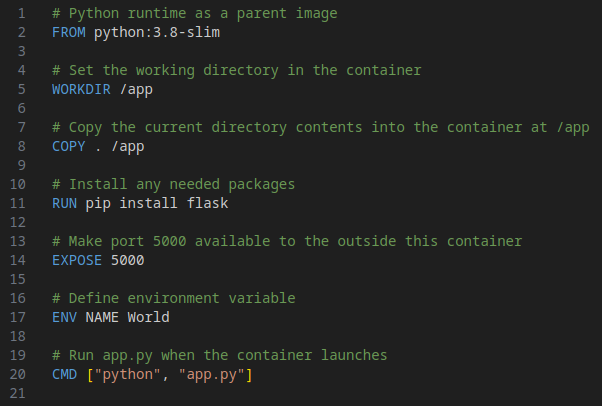

# **A simple guide to Docker**
Marcos Ferreira


---

## What is Docker?

A platform for building, runnning and deploying application in a consistent manner.

- If it works on your machine it works on others' machines.

---

**Why wouldn't an application work everywhere?**

- Missing files
- Software version mismatch
- Different configuration settings
- ...

---

**With docker we can easily package our application with everything it needs to run everywhere (any machine with docker\*)**

---

<style scoped>
p { text-align: center; }
</style>

### Packages


---

### Why not just use virtual Machines?

- **Virtual Machine:** An abstraction of a machine (physical hardware)
- **Container:** An isolated environment to run an application

---

<style scoped>
p { text-align: center; }
</style>


---

<style>
.container{
    display: flex;
}
.col{
    flex: 1;
}
</style>

<div class="container">

<div class="col">
    <h3>Virtual Machine:</h3>
    <ul>
    <li>Needs full OS</li>
    <li>Needs to be maintained</li>
    <li>Paid software</li>
    <li>Slow to start</li>
    <li>Too much resources</li>
    </ul>
</div>

<div class="col">
    <h3>Containers:</h3>
    <ul>
    <li>Multiple containers in isolation</li>
    <li>Lightweight</li>
    <li>Host controls resources</li>
    <li>Faster</li>
    </ul>
</div>

</div>

---

<style scoped>
p { text-align: center; }
</style>

### Can docker run on everything?


---

### Installing Docker

[https://docs.docker.com/engine/install/](https://docs.docker.com/engine/install/)

[https://labs.play-with-docker.com/](https://labs.play-with-docker.com/)

### Installing Docker compose

[https://docs.docker.com/compose/install/](https://docs.docker.com/compose/install/)

---

#### To verify if docker is installed we can run

```bash
docker version
```

**WINDOWS:** make sure Hyper-V and Containers are enabled!
**WINDOWS 2:** WSL might need to be installed/updated.

---

### Running our first container

Docker has a place where you can run pre made images: Dockerhub.

**You can try with these commands:**

- `docker pull <IMAGE NAME>` Downloads image from the internet
- `docker run <IMAGE NAME>` Runs the image
- `docker stop <IMAGE NAME>` Stops the image
- `docker start <IMAGE NAME>` Starts the image again
- `docker rm <IMAGE NAME>` Removes the image

---

## How to create our own images?

We create a file called `Dockerfile` where our project is!

A Dockerfile is a script containing commands that Docker uses to build images automatically.

---




### Simple Docker Workflow
- **Start with a base image**
- **Install necessary applications.**
- **Copy the required files.**
- **Execute configuration commands.**
- **Specify the command to run the application.**

---

<style>
.container{
    display: flex;
}
.col{
    flex: 1;
}
</style>

<div class="container">

<div class="col">
    <ol>
    <li>Python runtime as a parent image
        <blockquote>FROM python:3.8-slim</blockquote>
    </li>
    <li>Install any needed packages
        <blockquote>RUN pip install flask</blockquote>
    </li>
    <li>Set the working directory in the container
        <blockquote>WORKDIR /app</blockquote>
    </li>
    <li>Copy the current directory contents into the container at /app
        <blockquote>COPY . /app</blockquote>
    </li>
    </ol>
</div>

<div class="col">
    <ol start="5">
    <li>Make port 5000 available to the outside this container
        <blockquote>EXPOSE 5000</blockquote>
    </li>
    <li>Define environment variable
        <blockquote>ENV NAME World</blockquote>
    </li>
    <li>Run app.py when the container launches
        <blockquote>CMD ["python", "app.py"]</blockquote>
    </li>
    </ol>
</div>

</div>

---

**After creating our Dockerfile, we have the instruction to create an image:**

```bash
docker built -t <NAME> <WHERE>
```

---

### We can also see the images we have on our computer and manage them

- `docker image ls`
- `docke image rm <NAME>`

---

### How can I see the containers on my pc?

- `docker ps -a` | `-a` is optional but it will show containers not running
- `docker rm <NAME>` Removes a container

---

## There is a problem

### What if I made a mistake and want to remake my container? Where will my container files go?

---

### How to create volumes in Docker

- `docker volume create <NAME>` Creates a volume
- `docker volume list` Lists the volumes on the computer
- `docker volume rm <NAME>` Removes a volume

---

### How to use volumes on our container and advanced commands

**`Docker run` is more complex than we saw before, you can directly pass commands to it**

`--name <NAME>` Defines the name of the container
`-v <VOLUME NAME>:<PATH IN CONTAINER` Maps a volume to a folder inside the container
`-p <PC PORT>:<CONTAINER PORT>` Allows the container to use a port to make a connection
`-e <VAR>=<VALUE>` Creates a env variable in the container

---

# Great! Now we know how to use docker, right?

### What if we need more than one container?
### What if they need each other to work?

---

## Docker compose

It is a file that specifies how to create the containers and how they should work together.

In the same way we created a `Dockerfile` we can create a `docker-compose.yml`

---

## How to make a docker-compose.yml?

```yml
version: ’3.8’

services:
    NAME:
        image: my-web-app
        ports:
            - "5000:5000"
        environment:
            - DEBUG=1

    NAME2:
        build:
            context: FOLDER
            dockerfile: Dockerfile
        container_name: NAME
        restart: always
        volumes:
            - my-volume:/folder/in/container
        depends-on:
            - NAME
```

---

## How to define volumes and Networks?

```yml
volumes:
  volume1:
    name: volume1
  volume2:


networks:
  default:
    driver: bridge
```

--- 

## How to run the containers from our Docker compose?

- `docker-compose build` Builds the containers from our docker-compose.yml
- `docker-compose up` Runs the containers from our file
- `docker-compose down` Stops the container from our files
- `docker-compose rm` Removes the containers

**OBS:** you can do `docker-compose up --build` to build/rebuild then run

---

# Questions?