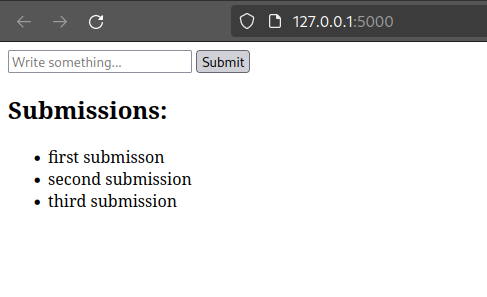

## Simple docker hands-on

This is a brief and simple tutorial. We have an `app.py` that run a website with a simple list and a place to add new entries to that list.



There is already a Dockerfile prepared, however if you want to make your own it is also a good idea.

To make your own Dockerfile, you have to:

1. Define the base image from which we are going to build upon:
> In this came the image is `python:3.8-slim`
> 
> To define it you can just do `FROM python:38-slim`

2. In the application we are using a python library called `Flask`, we also have to tell the Dockerfile to install this library so that it is available in the container:
> To define the library you have to run a command, in a Dockerfile, to run a command you do `RUN` followed by the command on the same line.
>
> The command we are running is `pip install flask`

3. We also have to copy the files from our application to the container, this can be done using the `COPY` command.
> We have to specify what to copy and where inside the container we are putting it.
>
> We can do `COPY . /app`, this command will copy all the files in this current folder into a folder called `app` inside the container
>
> In the same way can change the default folder the commands are running on inside the container. For that we can use `WORKDIR /app`. From this point forward the commands will assume we are in the `app` folder.

4. Since it is a website we have to open the internet port to allow for external connection to it. We are going to use port 5000, but you can choose a different one.
> To expose (or allow external connection to a port in the container) we can do `EXPOSE 5000`.

5. We have configured everything we needed to run this application. Finally, to actually run the application (when we run a container from the image created) we have to define the command for it. This is defined with the `CMD [...]` command.
> In our case the command will be `CMD ["python", "app.py"]`

The steps above create the Dockerfile we needed to generate an image, however we have not yet generated an image. To generate an image, from the terminal and in the same directory the Dockerfile is you can run:

```bash
docker build -t my-app .
```

This will create an image called `my-app`.

To run the image you can do:

```bash
docker run -p 5000:5000 --name my-app-1 my-app
```

The `-p` means that we are mapping the port 5000 of our pc to the port 5000 of the docker container, so that we can actually access it.

`--name my-app-1` is optional but it gives an specific name to the container, otherwise docker will assign it a random name

we can verify the container's information by running:

```bash
docker ps
```

There is just one problem, we want to remove the container to change something we will lose all the things we create in it (our list of items for example). We can prevent this by creating a volume that will store our information.

First lets remove the container:

```bash
docker stop my-app-1
docker rm my-app-1
```

The commands above will stop the container and remove it.

Then let's create a docker volume:

```bash
docker volume create my-app-volume
```

And lets also assign it to the container we are creating:

```bash
docker -p 5000:5000 --name my-app-1 -v my-app-volume:/app/data my-app
```

This will map the volume so that it stores everything that is inside the folder `/app/data/` inside the container, if we remove the container out things will still be there. Let's try:

```bash
docker stop my-app-1
docker rm my-app-1
docker -p 5000:5000 --name my-app-1 -v my-app-volume:/app/data my-app
```

You can access the the website and verify that the list is still there.

Just one more thing, we have not used the command but you dont have to create a new container to run it, you can also do:

```bash
docker start my-app-1
```

It will run a container that already exists but was stopped. You can check the list of containers stopped by doing:

```bash
docker ps -a
```

The command above will show the list of active and stopped containers.

Okay, to finish lets clean up all the things we did.

1. let's stop and remove the container

```bash
docker stop my-app-1
docker rm my-app-1
```

2. Since we removed the container we are also not going to need the volume, lets check it and then remove it:

```bash 
docker volume list
docker volume rm my-app-volume
```

3. Finally, lets remove the image we created:

```bash
docker image rm my-app
```
